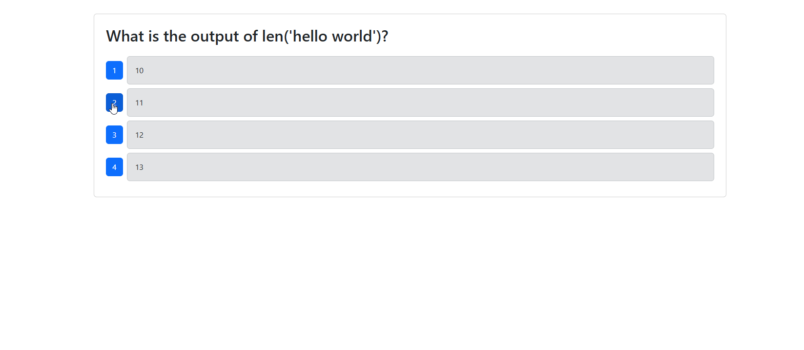
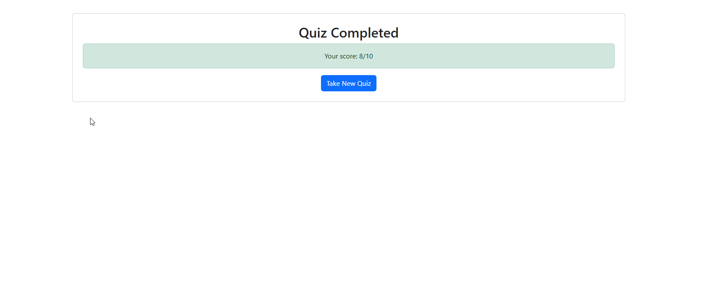
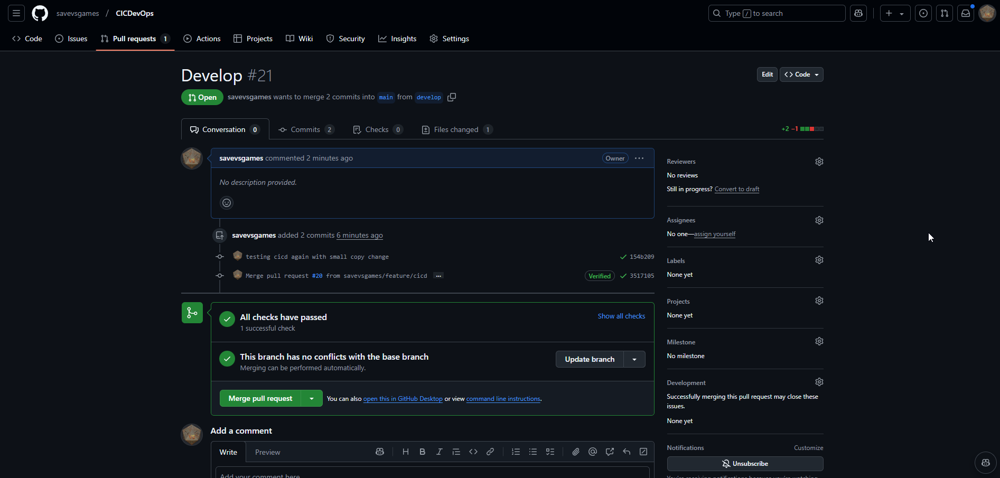
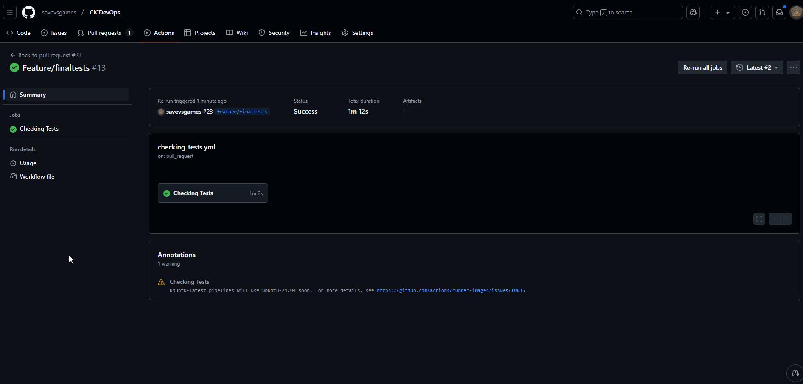
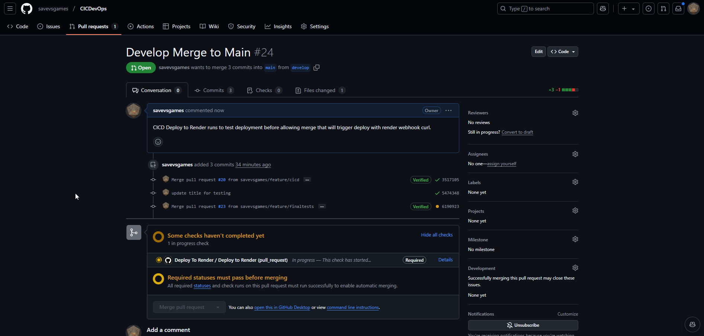
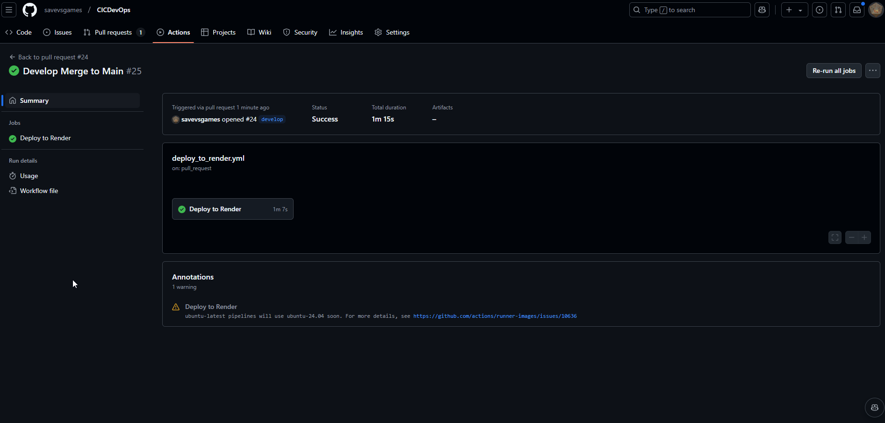

# **Coding Quiz App**

  
  
  
  
  


## **Description**

**_LIVE DEMO_**: [RENDER DEPOLOY LINK (expect a wait of around 2-minutes for demo servers to start)](https://cicdevops.onrender.com)

The Coding Quiz App is a full-stack web application designed to test your coding knowledge through interactive quizzes. The application ensures a seamless and engaging user experience, leveraging a robust backend and a responsive frontend.

This version of the application integrates Continuous Integration (CI) and Continuous Deployment (CD) using **GitHub Actions** and **Render**, providing automated testing and deployment pipelines for quality assurance and efficiency.














---

## **Table of Contents**

- [**Coding Quiz App**](#coding-quiz-app)
  - [**Description**](#description)
  - [**Table of Contents**](#table-of-contents)
  - [**Installation**](#installation)
  - [**Usage**](#usage)
  - [**Features**](#features)
  - [**Deployment**](#deployment)
  - [**Testing**](#testing)
    - [Local Testing](#local-testing)
  - [**License**](#license)
  - [**Contributing**](#contributing)
  - [**Questions**](#questions)

---

## **Installation**

1. Clone the repository:
   ```bash
   git clone https://github.com/savevsgames/CICDevOps.git
   ```
2. Navigate to the project directory:

   ```bash
   cd CICDevOps
   ```

3. Install dependencies for both the client and server:

   ```bash
   npm install
   ```

4. Build the project:

   ```bash
   npm run build
   ```

5. Seed the database:
   ```bash
   npm run seed
   ```

---

## **Usage**

Start the development server:

```bash
npm run develop
```

Access the application locally:

- **Frontend:** `http://localhost:3000`
- **Backend:** `http://localhost:5000`

---

## **Features**

- Interactive coding quizzes with multiple levels of difficulty.
- Real-time feedback and score tracking.
- Secure backend with MongoDB for data storage.
- Responsive frontend for seamless usage across devices.
- Automated CI/CD pipelines for testing and deployment.

---

## **Deployment**

The application is deployed on **Render** with the following steps:

1. Push changes to the `develop` branch.
2. Upon merging `develop` into `main`, GitHub Actions triggers automatic deployment via Render's Deploy Hook.

---

## **Testing**

This project uses **Cypress** for end-to-end and component testing. Automated tests are executed during CI/CD pipelines via GitHub Actions.

### Local Testing

Run component tests locally:

```bash
npm run test-component
```

Open Cypress GUI for test exploration:

```bash
npm run test-gui
```

---

## **License**

This project is licensed under the MIT License. For more details, see the [LICENSE](LICENSE) file.

---

## **Contributing**

Contributions are welcome! Please fork the repository and submit a Pull Request for review.

---

## **Questions**

For any questions, feel free to contact me:

- GitHub: [savevsgames](https://github.com/savevsgames)
- Email: [gregcbarker@gmail.com](mailto:gregcbarker@gmail.com)
